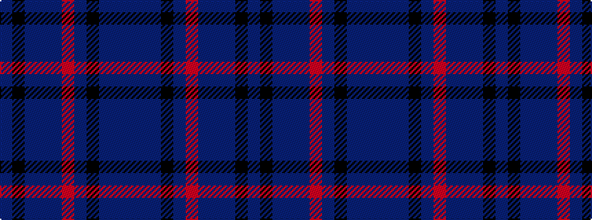

BBBKBRBBBKB

It is a 11 stripe tartan.

<figure class="pat-woven">

<figcaption>idealised sample</figcaption>
</figure>

## Colour Sequence



## Tartans with this colour sequence

| Tartans |
|---------------|
| [Paul Henry (Personal)](/variants/s11/dbi4db3n7k9n13r2dbi13db9n7k3n4~x2/)|
||
