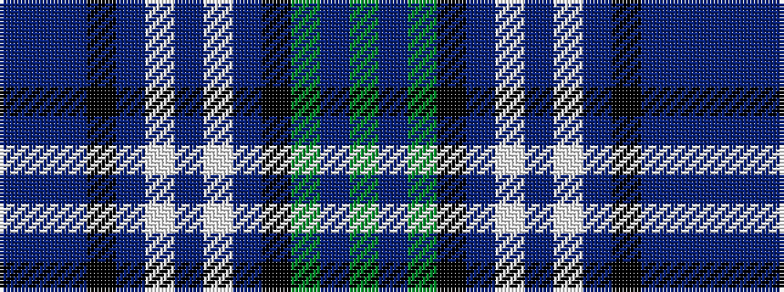

BBBKBWBWBKGBG

It is a 13 stripe tartan.

<figure class="pat-woven">

<figcaption>idealised sample</figcaption>
</figure>

## Colour Sequence



## Tartans with this colour sequence

| Tartans |
|---------------|
| [Redgate (Connecticut)](/setts/s13/n10dr3n10k7do5w2do5w2do5k7dg10dr3dg7~x2/)|
||
