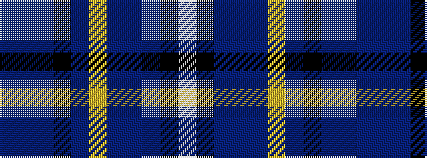

BBBKBYBBBKW

It is a 11 stripe tartan.

<figure class="pat-woven">

<figcaption>idealised sample</figcaption>
</figure>

## Colour Sequence



## Tartans with this colour sequence

| Tartans |
|---------------|
| [Connaught Ancestry](/variants/s11/db4do21db8k4db4lo4db9do9db38k1w3~x2/)|
||
| [Connaught Ancestry (Fashion)](/variants/s11/db4n21db8k4db4ly4db9n9db38k1lb3~x2/)|
||
