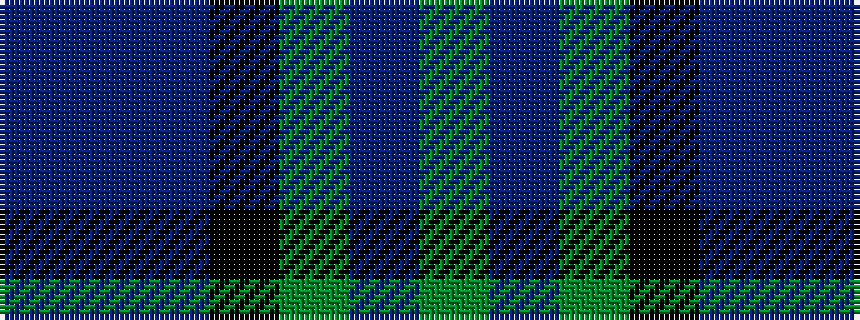

BBBKGBG

It is a 7 stripe tartan.

<figure class="pat-woven">

<figcaption>idealised sample</figcaption>
</figure>

## Colour Sequence



## Tartans with this colour sequence

| Tartans |
|---------------|
| [MacThomas](/setts/dg3dr2dg21k11db21dr2db3/)|
||
| [MacThomas LC](/variants/s7/dg5dp3dg32k16db32dp3db5/)|
||
| [MacThomas LC](/setts/dg5n3dg32k16db32dp3db5/)|
||
