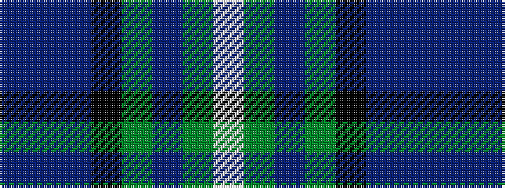

BBBKGBGW

It is a 8 stripe tartan.

<figure class="pat-woven">

<figcaption>idealised sample</figcaption>
</figure>

## Colour Sequence



## Tartans with this colour sequence

| Tartans |
|---------------|
| [Moray (Corporate)](/variants/s8/db15dp3db30k22dg18dp3dg3w3~x2/)|
||
