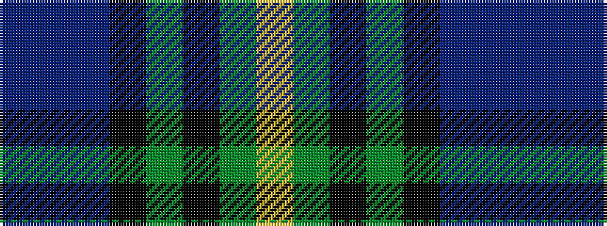

BBBKGKGY

It is a 8 stripe tartan.

<figure class="pat-woven">

<figcaption>idealised sample</figcaption>
</figure>

## Colour Sequence



## Tartans with this colour sequence

| Tartans |
|---------------|
| [McFadden (Personal)](/setts/s8/db18dp2db16k13g3k2g42lo3~x2/)|
||
