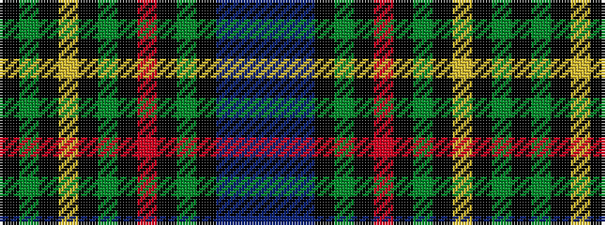

BBBKGKRKGKYKGK

It is a 14 stripe tartan.

<figure class="pat-woven">

<figcaption>idealised sample</figcaption>
</figure>

## Colour Sequence



## Tartans with this colour sequence

| Tartans |
|---------------|
| [Gow Hunting #2](/setts/s14/k24dg12k1ly3k1dg12k1r3k1dg12k12db12dbi3db12~x4/)|
||
| [Gow, hunting](/setts/s14/k24g12k1ly3k1g12k1r3k1g12k12db12dbi3db12~x4/)|
||
