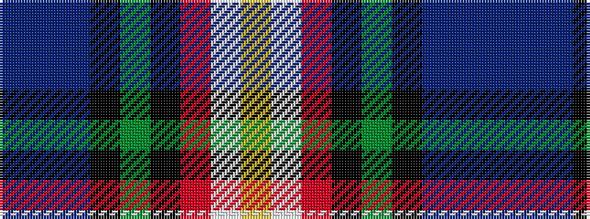

BBBKGKRWY

It is a 9 stripe tartan.

<figure class="pat-woven">

<figcaption>idealised sample</figcaption>
</figure>

## Colour Sequence



## Tartans with this colour sequence

| Tartans |
|---------------|
| [Brooke](/setts/s9/db1t1db1k8g10k8r1w1ly1~x2/)|
||
| [Brooke (D.C.Dalgliesh version)](/setts/s9/db1t1db1k8dg10k8r1w1ly1~x2/)|
||
