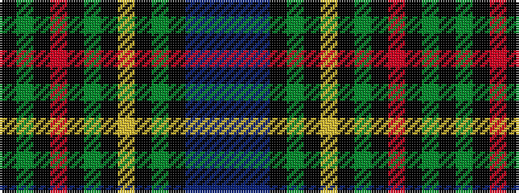

BBBKGKYKGKRKGK

It is a 14 stripe tartan.

<figure class="pat-woven">

<figcaption>idealised sample</figcaption>
</figure>

## Colour Sequence



## Tartans with this colour sequence

| Tartans |
|---------------|
| [Gow Hunting Family Tartan](/variants/s14/k12g12k1r1k1g12k1ly3k1g12k12dbi12db3dbi12~x4/)|
||
