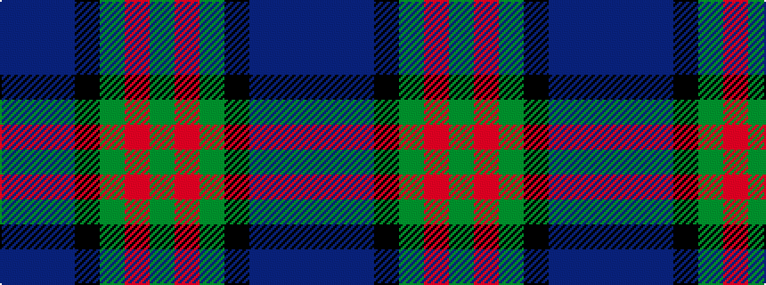

BBBKGRG

It is a 7 stripe tartan.

<figure class="pat-woven">

<figcaption>idealised sample</figcaption>
</figure>

## Colour Sequence



## Tartans with this colour sequence

| Tartans |
|---------------|
| [Cairngorm #2](/variants/s7/n5t4n22k15y22o4y4~x2/)|
||
| [Wcwm 9275-1395](/variants/s7/db6dp3db56k24g6r6g6/)|
||
