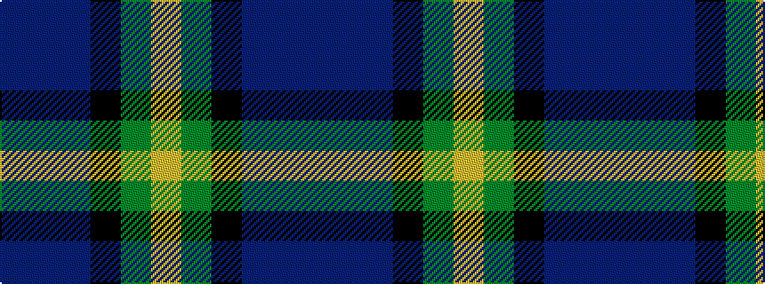

BBBKGY

It is a 6 stripe tartan.

<figure class="pat-woven">

<figcaption>idealised sample</figcaption>
</figure>

## Colour Sequence



## Tartans with this colour sequence

| Tartans |
|---------------|
| [Midlothian](/variants/s6/db31b4db5k19g20ly4~x2/)|
||
| [Midlothian](/variants/s6/db31b4db5k19g20lo4~x2/)|
||
