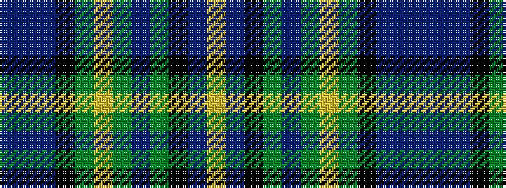

BBBKGYGBGKBY

It is a 12 stripe tartan.

<figure class="pat-woven">

<figcaption>idealised sample</figcaption>
</figure>

## Colour Sequence



## Tartans with this colour sequence

| Tartans |
|---------------|
| [Scottish Women's Rural Institutes](/variants/s12/db6t2db20k15g20ly2g6t2g20k15db20ly4~x2/)|
||
