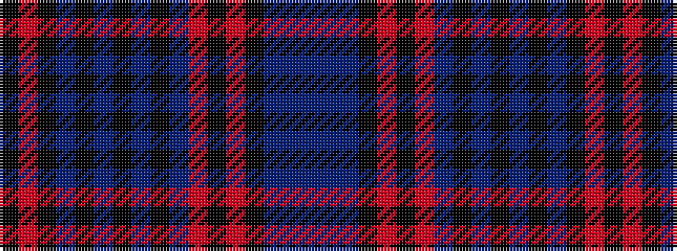

BBBKRKRBKBKBKBKRK

It is a 17 stripe tartan.

<figure class="pat-woven">

<figcaption>idealised sample</figcaption>
</figure>

## Colour Sequence



## Tartans with this colour sequence

| Tartans |
|---------------|
| [Burns, Virginia (Personal)](/variants/s17/dp20b12dp12k5r2k5r2dp4k2b3k2b3k2dp4k5r2k5~x2/)|
||
