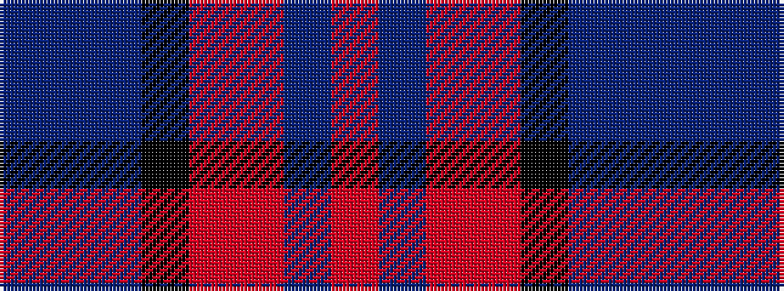

BBBKRRBR

It is a 8 stripe tartan.

<figure class="pat-woven">

<figcaption>idealised sample</figcaption>
</figure>

## Colour Sequence



## Tartans with this colour sequence

| Tartans |
|---------------|
| [St. Leonards (Corporate)](/variants/s8/r16db2o6r3k4t2db40t6~x2/)|
||
