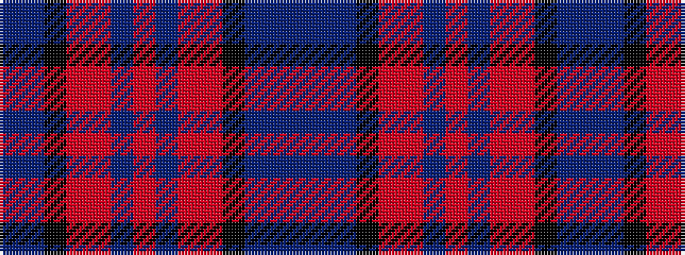

BBBKRRBRBRRKBB

It is a 14 stripe tartan.

<figure class="pat-woven">

<figcaption>idealised sample</figcaption>
</figure>

## Colour Sequence



## Tartans with this colour sequence

| Tartans |
|---------------|
| [St. Leonards](/setts/s14/db40t2k4r3o6db2r16db2o6r3k4t2db40t6~x2/)|
||
