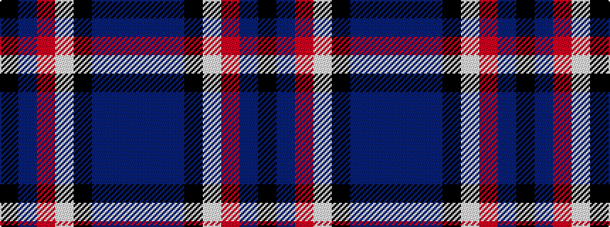

BBBKWRBK

It is a 8 stripe tartan.

<figure class="pat-woven">

<figcaption>idealised sample</figcaption>
</figure>

## Colour Sequence



## Tartans with this colour sequence

| Tartans |
|---------------|
| [Moorpark Primary School (Corporate)](/variants/s8/db3n10db3k3w10r4n28k2~x2/)|
||
