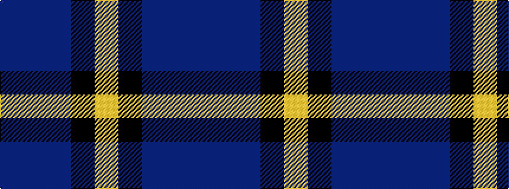

BBBKY

It is a 5 stripe tartan.

<figure class="pat-woven">

<figcaption>idealised sample</figcaption>
</figure>

## Colour Sequence



## Tartans with this colour sequence

| Tartans |
|---------------|
| [Burnett's & Struth (Corporate)](/variants/s5/dt68b7dt16k16lo4~x2/)|
||
| [Burnetts & Struth](/variants/s5/dt68t7dt16k16lo4~x2/)|
||
