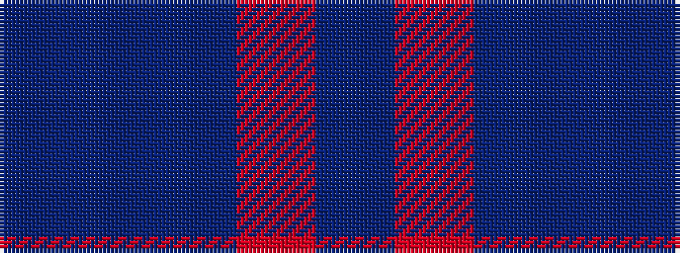

BBBRB

It is a 5 stripe tartan.

<figure class="pat-woven">

<figcaption>idealised sample</figcaption>
</figure>

## Colour Sequence



## Tartans with this colour sequence

| Tartans |
|---------------|
| [Bryson](/variants/s5/t8r3dbi29db29t4~x2/)|
||
| [Romanes Check (Fashion)](/variants/s5/dt2n21dt11r21dt1~x2/)|
||
