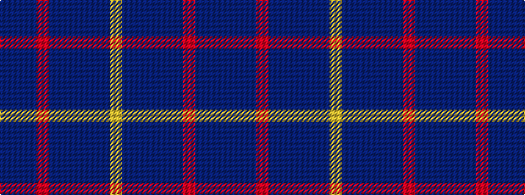

BBBRBBBBBY

It is a 10 stripe tartan.

<figure class="pat-woven">

<figcaption>idealised sample</figcaption>
</figure>

## Colour Sequence



## Tartans with this colour sequence

| Tartans |
|---------------|
| [Bank of Scotland (2000)](/setts/s10/b64db3dt4r5dt8dti12b3dti4b2lo1~x2/)|
||
