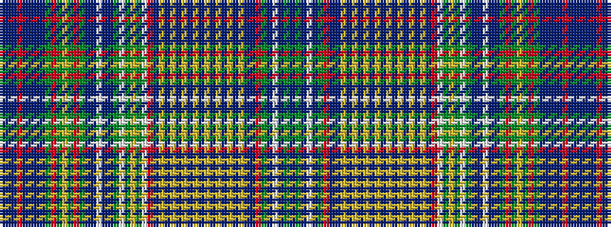

BBBRBBBBGRGYGRGBBWBBGWGYGWRBYBYBYBYBYBYBYBYBBRGBWBGB

It is a 52 stripe tartan.

<figure class="pat-woven">

<figcaption>idealised sample</figcaption>
</figure>

## Colour Sequence



## Tartans with this colour sequence

| Tartans |
|---------------|
| [Lawson, Robin (Personal)](/setts/s52/dt1dg10dt4w1dt4dg10r1dt4t3lo1dt1lo1dt1lo1dt1lo1dt1lo1dt1lo1dt1lo1dt1lo1dt5r20w2dg3lo3dg3w2dg20dt4t4w2t4dt4dg10r3dg3lo2dg3r3dg10dt1t1dt1t7r2t7dt1t1~x2/)|
||
