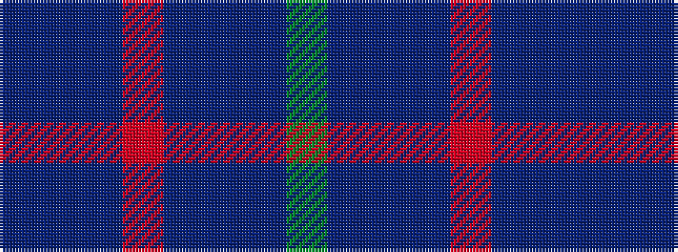

BBBRBBBG

It is a 8 stripe tartan.

<figure class="pat-woven">

<figcaption>idealised sample</figcaption>
</figure>

## Colour Sequence



## Tartans with this colour sequence

| Tartans |
|---------------|
| [Scottish Netball Association (1987)](/setts/s8/dp20db9dp20r2dp20db9dp20g2~x2/)|
||
