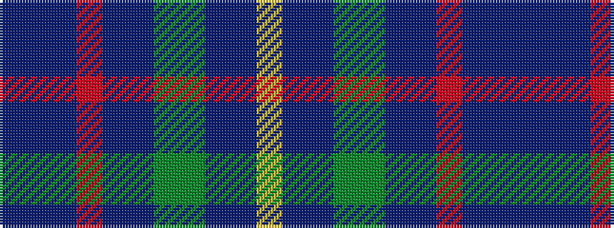

BBBRBBGGBBY

It is a 11 stripe tartan.

<figure class="pat-woven">

<figcaption>idealised sample</figcaption>
</figure>

## Colour Sequence



## Tartans with this colour sequence

| Tartans |
|---------------|
| [State Seal of New York (Fashion)](/variants/s11/dt60b5dt4r6dt4b5dy22g5b23dt1lo4~x2/)|
||
