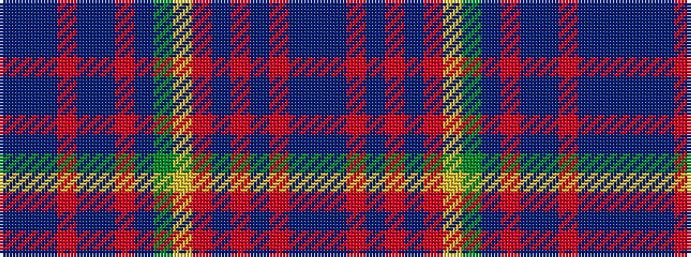

BBBRBBRBGYRBRBRBB

It is a 17 stripe tartan.

<figure class="pat-woven">

<figcaption>idealised sample</figcaption>
</figure>

## Colour Sequence



## Tartans with this colour sequence

| Tartans |
|---------------|
| [Scotland's Grace](/setts/s17/n24t2n4m2t2n4m4t5g5ly3r7ni2r2ni3r1ni23n4~x2/)|
||
