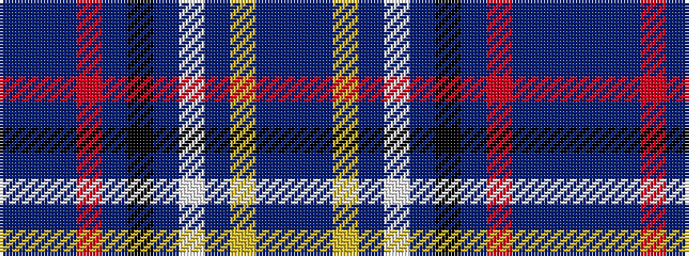

BBBRBKBWBYBB

It is a 12 stripe tartan.

<figure class="pat-woven">

<figcaption>idealised sample</figcaption>
</figure>

## Colour Sequence



## Tartans with this colour sequence

| Tartans |
|---------------|
| [Manchester City Football Club "Blue Moon"](/setts/s12/db4t16db4r2db2k2db2w5db3ly2db2t2~x2/)|
||
