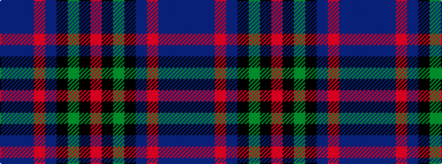

BBBRBKGKR

It is a 9 stripe tartan.

<figure class="pat-woven">

<figcaption>idealised sample</figcaption>
</figure>

## Colour Sequence



## Tartans with this colour sequence

| Tartans |
|---------------|
| [Holland & Sherry (Corporate)](/variants/s9/dt20b3dt4r3dt3k10g21k4r20~x2/)|
||
