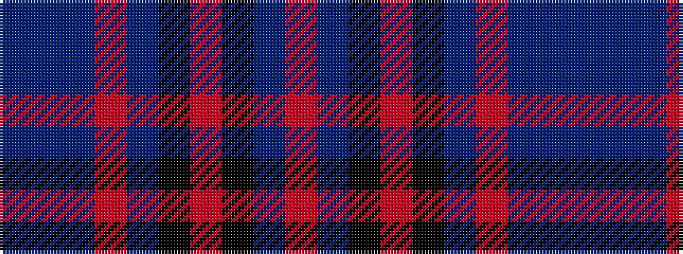

BBBRBKRKBR

It is a 10 stripe tartan.

<figure class="pat-woven">

<figcaption>idealised sample</figcaption>
</figure>

## Colour Sequence



## Tartans with this colour sequence

| Tartans |
|---------------|
| [Ballater](/setts/s10/db3t1db6r2b6k1r1k1b6r3~x4/)|
||
