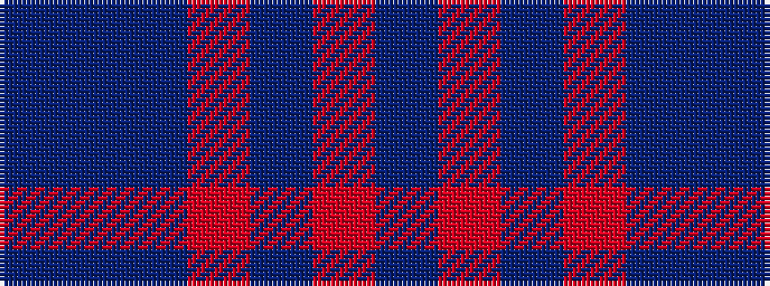

BBBRBRB

It is a 7 stripe tartan.

<figure class="pat-woven">

<figcaption>idealised sample</figcaption>
</figure>

## Colour Sequence



## Tartans with this colour sequence

| Tartans |
|---------------|
| [Lochaber Old](/setts/s7/db3r1db35r1db16t1db2~x4/)|
||
