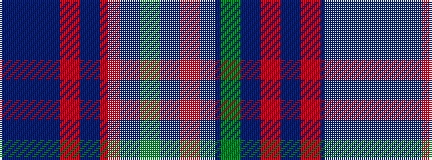

BBBRBRBGBR

It is a 10 stripe tartan.

<figure class="pat-woven">

<figcaption>idealised sample</figcaption>
</figure>

## Colour Sequence



## Tartans with this colour sequence

| Tartans |
|---------------|
| [Rikaco Red](/variants/s10/dt5n5dt2r47dt18o2dt5dy9n7o3~x2/)|
||
