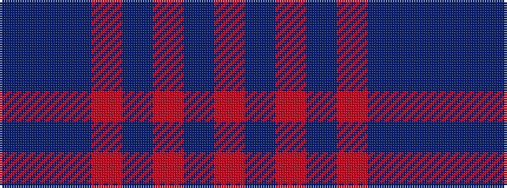

BBBRBRBR

It is a 8 stripe tartan.

<figure class="pat-woven">

<figcaption>idealised sample</figcaption>
</figure>

## Colour Sequence



## Tartans with this colour sequence

| Tartans |
|---------------|
| [Chindecella Ruadh (Personal)](/variants/s8/r10db4r4db4r23n19db19n4~x2/)|
||
