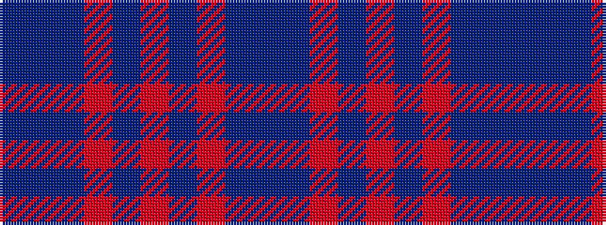

BBBRBRBRBB

It is a 10 stripe tartan.

<figure class="pat-woven">

<figcaption>idealised sample</figcaption>
</figure>

## Colour Sequence



## Tartans with this colour sequence

| Tartans |
|---------------|
| [Flowers of the Forest, The](/setts/s10/b8t4do5r1do5r1do5r1do16b1~x4/)|
||
