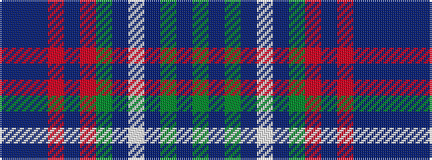

BBBRBRGBWBGBG

It is a 13 stripe tartan.

<figure class="pat-woven">

<figcaption>idealised sample</figcaption>
</figure>

## Colour Sequence



## Tartans with this colour sequence

| Tartans |
|---------------|
| [Massachusetts - The Bay State](/variants/s13/g12db6g6db22lb4db8g4r8db10r3db48b4db8/)|
||
| [Massachusetts - The Bay State (Dist)](/variants/s13/g12db6g6db22lb4db8g4r8db10r3db48t4db8/)|
||
| [Massachusetts-The Bay State](/variants/s13/dg6db3dg3db11w2db4dg2r4db5r2db24b2db4~x2/)|
||
