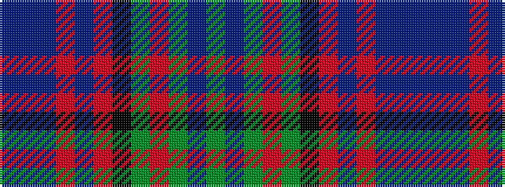

BBBRBRKGRGBG

It is a 12 stripe tartan.

<figure class="pat-woven">

<figcaption>idealised sample</figcaption>
</figure>

## Colour Sequence



## Tartans with this colour sequence

| Tartans |
|---------------|
| [Denovan, The Lairdship of (Personal)](/variants/s12/db10dp2db3r4db14r2k14g14r4g3dp2g10~x2/)|
||
| [Denovan, The Lairdship of..](/variants/s12/db10p2db3r4db14r2k14g14r4g3p2g10~x2/)|
||
