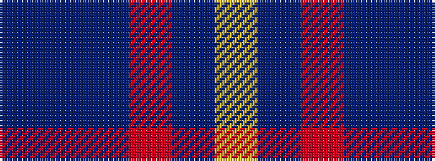

BBBRBY

It is a 6 stripe tartan.

<figure class="pat-woven">

<figcaption>idealised sample</figcaption>
</figure>

## Colour Sequence



## Tartans with this colour sequence

| Tartans |
|---------------|
| [Torridon Tweed](/variants/s6/n4db1n6m1n14lr1~x8/)|
||
