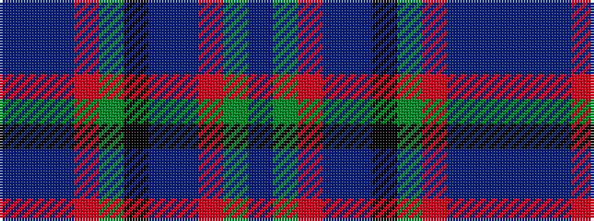

BBBRGKBBRGB

It is a 11 stripe tartan.

<figure class="pat-woven">

<figcaption>idealised sample</figcaption>
</figure>

## Colour Sequence



## Tartans with this colour sequence

| Tartans |
|---------------|
| [Coopers & Lybrand](/setts/s11/t4g4r1db24t4k2g24r1db10t4db2~x2/)|
||
