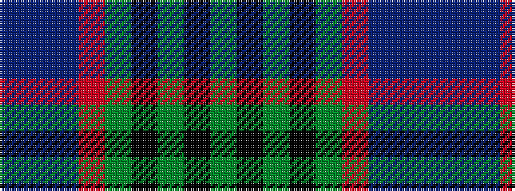

BBBRGKGKG

It is a 9 stripe tartan.

<figure class="pat-woven">

<figcaption>idealised sample</figcaption>
</figure>

## Colour Sequence



## Tartans with this colour sequence

| Tartans |
|---------------|
| [West Lothian](/setts/s9/g40k8g4k8g4r14db64t9db3/)|
||
