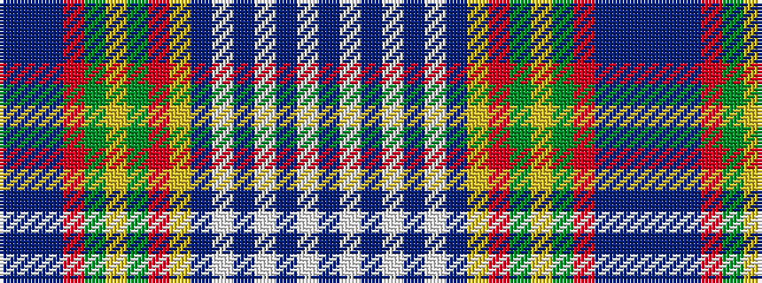

BBBRGYGRYBWBWBWB

It is a 16 stripe tartan.

<figure class="pat-woven">

<figcaption>idealised sample</figcaption>
</figure>

## Colour Sequence



## Tartans with this colour sequence

| Tartans |
|---------------|
| [Saint Joseph de Sorel](/variants/s16/t8w1t3w1t3w1t8ly2o9g2lo5g2r12t8t3t3~x2/)|
||
