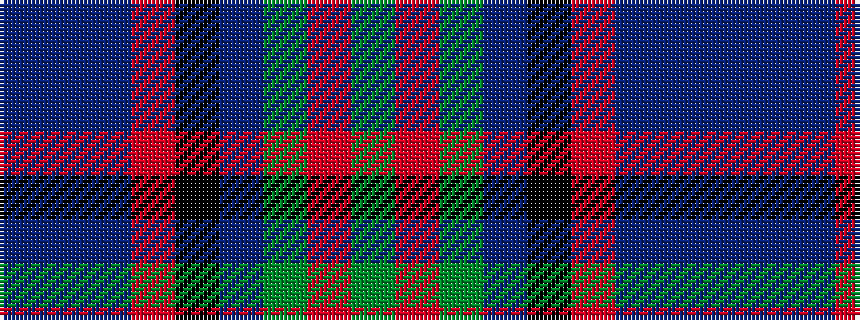

BBBRKBGRG

It is a 9 stripe tartan.

<figure class="pat-woven">

<figcaption>idealised sample</figcaption>
</figure>

## Colour Sequence



## Tartans with this colour sequence

| Tartans |
|---------------|
| [Ithilien Heather (Personal)](/variants/s9/dg20r2y3dt12k20r2n3dt4n3~x2/)|
||
| [Ithilien Heather (Personal)](/variants/s9/g20r2y3dt12k20r2t3dt4t3~x2/)|
||
