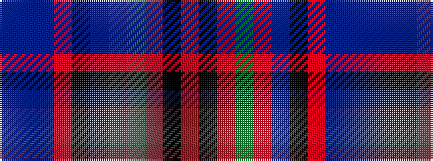

BBBRKBRGRKR

It is a 11 stripe tartan.

<figure class="pat-woven">

<figcaption>idealised sample</figcaption>
</figure>

## Colour Sequence



## Tartans with this colour sequence

| Tartans |
|---------------|
| [Lochaber Cameron](/variants/s11/db8t3db40r3k44t3r3g40r2k4r7~x2/)|
||
