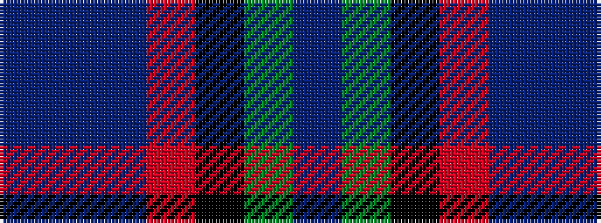

BBBRKGB

It is a 7 stripe tartan.

<figure class="pat-woven">

<figcaption>idealised sample</figcaption>
</figure>

## Colour Sequence



## Tartans with this colour sequence

| Tartans |
|---------------|
| [U.S. 2001 Air Force (Military?)](/setts/s7/db49g3k22r2b33db3b7~x2/)|
||
