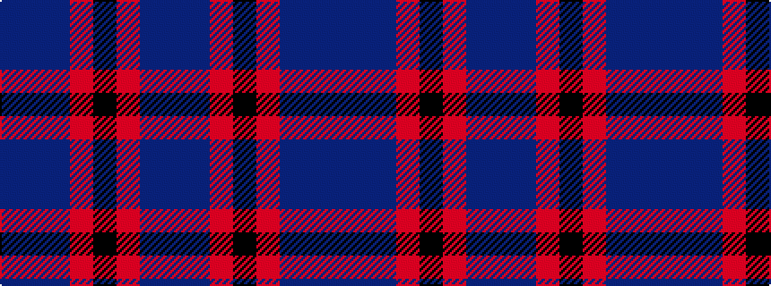

BBBRKRBB

It is a 8 stripe tartan.

<figure class="pat-woven">

<figcaption>idealised sample</figcaption>
</figure>

## Colour Sequence



## Tartans with this colour sequence

| Tartans |
|---------------|
| [Leonard (Name)](/variants/s8/b36db6b5r3k2r3b5db18~x2/)|
||
