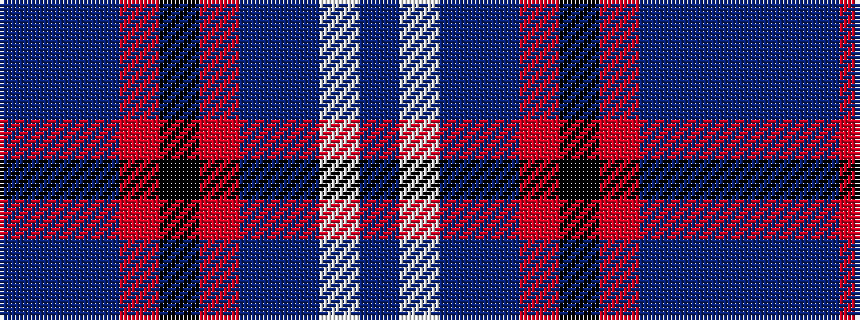

BBBRKRBBWB

It is a 10 stripe tartan.

<figure class="pat-woven">

<figcaption>idealised sample</figcaption>
</figure>

## Colour Sequence



## Tartans with this colour sequence

| Tartans |
|---------------|
| [Custer (Personal)](/variants/s10/db20w1dp8t1r2k3r2t1dp20db8~x2/)|
||
