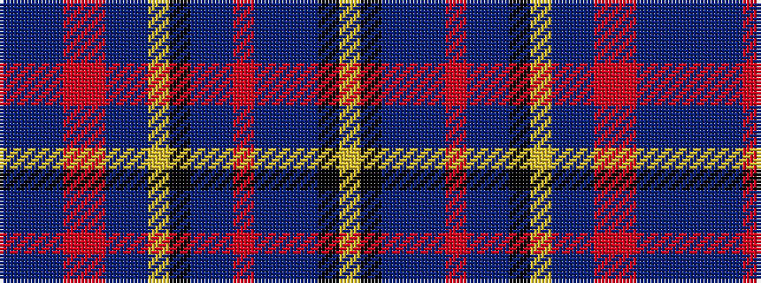

BBBRRBBYKBBRBBBKY

It is a 17 stripe tartan.

<figure class="pat-woven">

<figcaption>idealised sample</figcaption>
</figure>

## Colour Sequence



## Tartans with this colour sequence

| Tartans |
|---------------|
| [Kennewell (Personal)](/setts/s17/db25b15dt6o3r2db10b5lr5k2b15db25o5dt2b25db15k6lr3/)|
||
