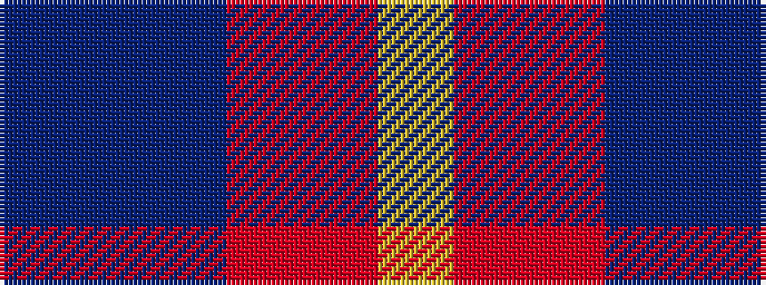

BBBRRY

It is a 6 stripe tartan.

<figure class="pat-woven">

<figcaption>idealised sample</figcaption>
</figure>

## Colour Sequence



## Tartans with this colour sequence

| Tartans |
|---------------|
| [Stevens #3](/setts/s6/dp2t9dp3r7r19ly2~x2/)|
||
