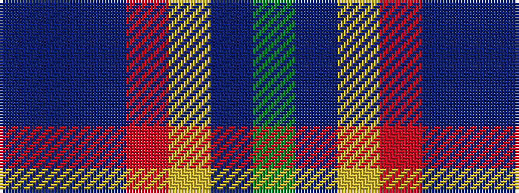

BBBRYBG

It is a 7 stripe tartan.

<figure class="pat-woven">

<figcaption>idealised sample</figcaption>
</figure>

## Colour Sequence



## Tartans with this colour sequence

| Tartans |
|---------------|
| [Falardeau-Murphy (Canada) (Personal)](/setts/s7/dg21t21ly3r21dt3dp5dt3~x2/)|
||
| [Falardeau-Murphy (Canada) (Personal)](/setts/s7/g21t21ly3r21n3dp5n3~x2/)|
||
