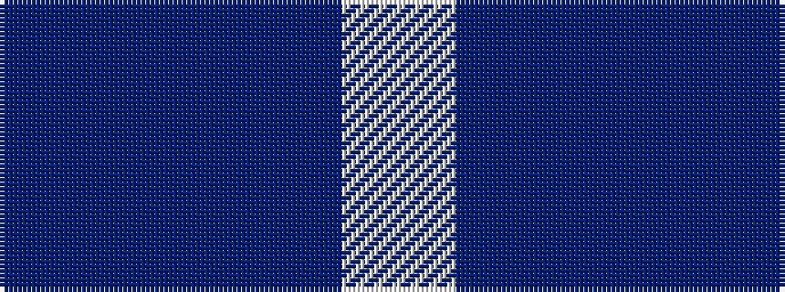

BBBW

It is a 4 stripe tartan.

<figure class="pat-woven">

<figcaption>idealised sample</figcaption>
</figure>

## Colour Sequence



## Tartans with this colour sequence

| Tartans |
|---------------|
| [Manx Cornaa (Personal)](/setts/s4/t1db5t5w1~x4/)|
||
| [Manx, Cornaa](/setts/s4/b1db5b5w1~x4/)|
||
