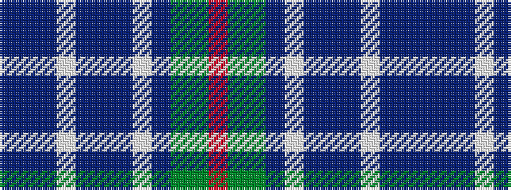

BBBWBBBWBGGR

It is a 12 stripe tartan.

<figure class="pat-woven">

<figcaption>idealised sample</figcaption>
</figure>

## Colour Sequence



## Tartans with this colour sequence

| Tartans |
|---------------|
| [Patterson, William John Magee (Personal)](/setts/s12/db9n3db2lb2db9n6db3lb3db3g18dg8r2~x2/)|
||
