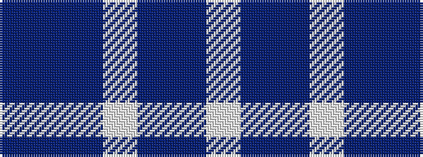

BBBWBBW

It is a 7 stripe tartan.

<figure class="pat-woven">

<figcaption>idealised sample</figcaption>
</figure>

## Colour Sequence



## Tartans with this colour sequence

| Tartans |
|---------------|
| [Earl of St. Andrews Dress](/setts/s7/w20db14dt14w4dbi2b2dt7~x2/)|
||
| [Earl of St. Andrews Dress (Dance)](/setts/s7/w20db14b14w4dt2t2b7~x2/)|
||
| [St. Andrews Dress, Earl of (Danc](/setts/s7/w28t19dbi19w4db2p2dbi7~x2/)|
||
