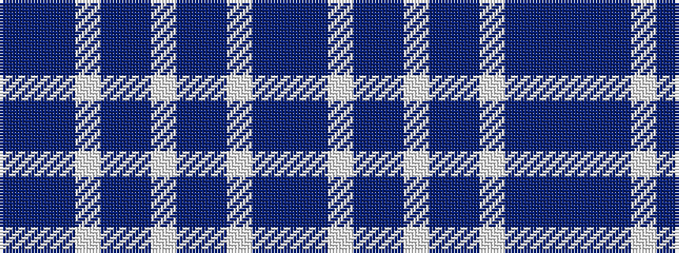

BBBWBBWBBWBB

It is a 12 stripe tartan.

<figure class="pat-woven">

<figcaption>idealised sample</figcaption>
</figure>

## Colour Sequence



## Tartans with this colour sequence

| Tartans |
|---------------|
| [St. Andrews Dress, Earl of](/variants/s12/w28t19dbi19w4db2p2dbi7~x2/)|
||
