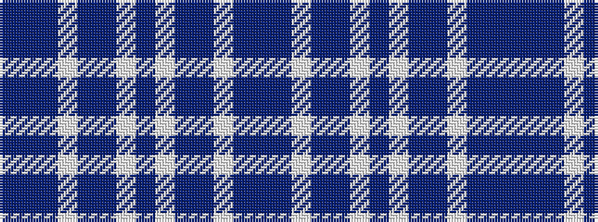

BBBWBBWBWBBWBB

It is a 14 stripe tartan.

<figure class="pat-woven">

<figcaption>idealised sample</figcaption>
</figure>

## Colour Sequence



## Tartans with this colour sequence

| Tartans |
|---------------|
| [Salem Scottish Dancers (Dance) #2](/variants/s14/dt5b5dt30w4dt4b18w3dt3w3b18dt4w4dt30b5~x2/)|
||
