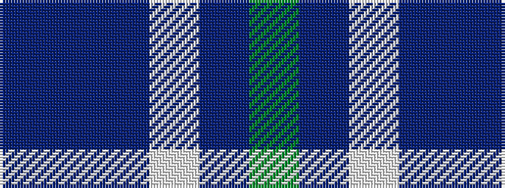

BBBWBG

It is a 6 stripe tartan.

<figure class="pat-woven">

<figcaption>idealised sample</figcaption>
</figure>

## Colour Sequence



## Tartans with this colour sequence

| Tartans |
|---------------|
| [Rhode Island, The State of](/setts/s6/g15dt2w2dt11n28dt4~x2/)|
||
